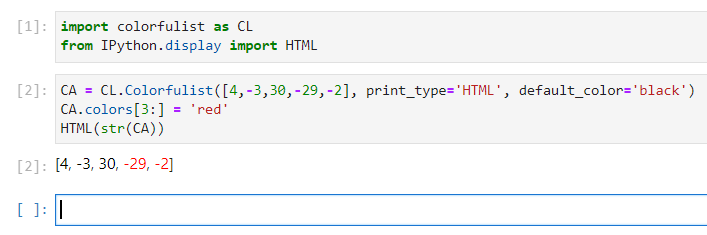

# colorfulist
Python colorful lists in console or iPy Notebooks

# Installation
## From source
```bash
git clone https://github.com/j0k/colorfulist
cd colorfulist
python3 -m pip install .
```

# Example

```python
import colorfulist as CL
L = CL.Colorfulist([1,2,3,4,5])
L.colors[-1] = 'red'
print(L)

L.colors[:3] = 'green'
print(L)

is_even = lambda x: x%2 ==0
L.coloring(is_even, 'yellow')
print(L)
L.reset_colors()
```


## IPython example

```python
import colorfulist as CL
from IPython.display import HTML
CA = CL.Colorfulist([4,-3,30,-29,-2], print_type='HTML', default_color='black')
CA.colors[3:] = 'red'
HTML(str(CA))
```



## IPython example with max-sum sublist

TODO: THIS SECTION
<details>
<summary>Code of get_maxsum_sublist() function</summary>

  ```python
  def get_maxsum_sublist(lst): ...
  ```
</details>


# How it works

Colorfulist used `Colorama` python lib and `colorfulist.Colorfulist(list)` is a class which
inherits `list` with field `.colors`. Colors contains color labels like 'red', 'green', 'blue' and etc. Class override such list methods like `insert`, `append`, `extend`, `__str__` and
`reverse`.

Full list of colors is presented in `color_table` var in [colorfulist.py](https://github.com/j0k/colorfulist/blob/main/src/colorfulist/colorfulist.py).

```python
color_table = {
    'black'  : Fore.BLACK,
    'red'    : Fore.RED,
    'green'  : Fore.GREEN,
    'yellow' : Fore.YELLOW,
    'blue'   : Fore.BLUE,
    'magenta': Fore.MAGENTA,
    'cyan'   : Fore.CYAN,
    'white'  : Fore.WHITE
}
```


# Futhermore

Any ideas, questions and updates plz commit in github [issue section](https://github.com/j0k/colorfulist/issues). Feel good :>
